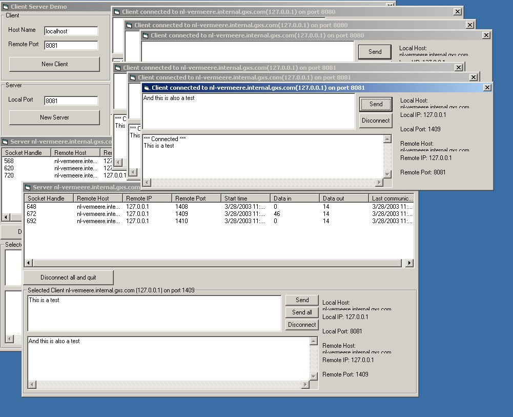



## Generic Client and Server \(Winsock API only, dll wrapper, suporting multiple instances, subclassing\)

### Description

A newer version is located at:

http://www.planet-source-code.com/vb/scripts/ShowCode.asp?txtCodeId=62794&amp;lngWId=1

- - - - - - - - - - - - - - - - - - - - - - - - - - - - - - - - - - - - - - - - - - - - - -

With this it is easy to run multiple instances of a client or server. It is an API only winsock wrapper setup as an active X dll. The bennefit of this is that it uses very litle memory (compared to the inet control), it's very fast, you do not need a form and its very easy to create multiple instances. I tested it with 4 servers and 400 clients on 1 machine. Also included in this submition is the best subclass code there is (Thanks Paul) and the best Error handling code there is (Thanks Thushan) It even includes support for GPF errors. If you want to see the Error handling in action, then unmark the line with err.raise in the Subclass.cls. Changed in this version: 1. Fixed the Stack overflow when there were to manny clients sending to much data at the same time. This happened when ther was about 5MB of data that still needed to be processed. 2. Fixed the overflow error in the subclass code than sometimes could happen on a win98. 3. Improved the error handling. If you are tinking of creating a server then also have a look at my other submition for creating a NT service (very easy) http://www.planet-source-code.com/vb/scripts/ShowCode.asp?txtCodeId=44568&amp;lngWId=1

----

Advertisement: If you want a valuable developers tool then look at http://siteskinner.com This will give you a library with some great objects that you can use. Like: FTP, POP, SMTP, Telnet, DOS, publishing database information as HTML (plus email), triple des encryption, hook into internet explorer, internet connection state, Windows task scheduler, generic tcp/ip client and server, Web page data grabber, capture dos command output, ...

----

 
### More Info
 

             |
---                |---
**Submitted On**   |2003-04-04 08:24:48
**By**             |[Edwin Vermeer\.](https://github.com/Planet-Source-Code/PSCIndex/blob/master/ByAuthor/edwin-vermeer.md)
**Level**          |Intermediate
**User Rating**    |4.2 (21 globes from 5 users)
**Compatibility**  |VB 6\.0
**Category**       |[Libraries](https://github.com/Planet-Source-Code/PSCIndex/blob/master/ByCategory/libraries__1-49.md)
**World**          |[Visual Basic](https://github.com/Planet-Source-Code/PSCIndex/blob/master/ByWorld/visual-basic.md)
**Archive File**   |[Generic\_Cl158201522003\.zip](https://github.com/Planet-Source-Code/edwin-vermeer-generic-client-and-server-winsock-api-only-dll-wrapper-suporting-multiple-in__1-44590/archive/master.zip)

